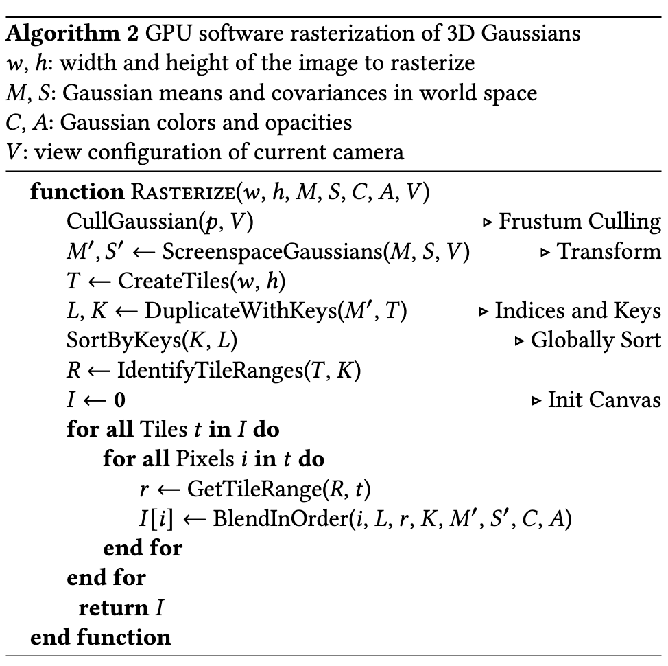

# 3-D Gaussian Splat Renderer in Python

A highly parallelized implementation of a 3-D Gaussian Splatting renderer with Python, PyTorch, and a Triton kernel.

The renderer implementation largely follows the description from Algorithm 2 of the original 3DGS [paper](https://arxiv.org/abs/2308.04079) (Kerbl et al. 2023). Additional details were based on Appendix C of the technical [report](https://arxiv.org/abs/2409.06765) for the `gsplat` [library](https://github.com/nerfstudio-project/gsplat) report. No other sources or code were consulted while preparing this implementation.

*Algorithm 2 from Kerbl et al. 2023, describing the rasterization-based approach to render Gaussians.*

### Implementation details

The actual implementation requires interleaving culls with calculation steps for efficiency, which significantly impacts the structure of the final implementation, such that the actual order and complexity of the steps taken differ from Algorithm 2. Specifically, my approach takes the following steps.

**Inputs**: For each Gaussian, we require its 3-D mean $\mathbf{\mu}$ in world space, its 3-D covariance $\Sigma_\text{3D}$, the spherical harmonic coefficients used to represent its view-dependent colors, and its opacity $\alpha$. We are provided the camera intrinsics, i.e., the focal lengths (in pixel units) $f_x$ and $f_y$ and the principal point $(c_x, c_y)$ of the camera; we are also provided the camera extrinsics for each of the required views, i.e., a $(4 \times 4)$ matrix of the form 
$$
\begin{bmatrix}
\mathbf{R} & \boldsymbol{t} \\
\hline
\mathbf{0} & 1
\end{bmatrix}
$$ 
describing the world-to-camera rotation and translation in homogeneous coordinates. Our goal is to rasterize the image to a 2-D pixel grid of dimensions $(w, h)$. 

**Rasterization loop**: For every camera view (i.e., every camera extrinsic pair $\mathbf{R}, \mathbf{t}$)

1. **Camera space projection**: Project the Gaussian means from world space to camera space as $\mathbf{\mu}_{c} = \mathbf{R}^T (\mathbf{\mu} - \mathbf{t})$.
1. **Viewing plane Gaussian culling**: Gaussians whose $z$-coordinates are too close to the camera (0.01) are removed
1. **2-D projection**: Take $\mu_x, \mu_y$ as the $x$ and $y$ components of the 3-D camera-space mean $\mu_c$. Calculate the corresponding rasterized 2-D pixel coordinates as $\mu' = (p_i, p_j)$ where $p_i = f_x (\mu_x / \mu_z) + c_x - 0.5$ and $p_j = f_y (\mu_y / \mu_z) + c_y - 0.5$. 
1. **2-D view frustum cull**: Remove Gaussians which are not inside the pixel grid, i.e., restricted to $x \in [x_\text{min}, x_\text{max}]$ and $y \in [y_\text{min}, y_\text{max}]$, where we calculate, using camera intrinsics and the dimensions of the rasterized image, $x_\text{min} = \frac{-c_x}{f_x}$, $x_\text{max} = \frac{w - c_x}{f_x}$, $y_\text{min} = \frac{-c_y}{f_y}$, $y_\text{max} = \frac{h - c_y}{f_y}$.
1. **2-D Gaussian approximation**: For efficient rasterization, 3DGS converts the 3-D Gaussian PDFs into 2-D Gaussian PDFs with a first-order Taylor approximation, such that exact confidence intervals for intersection of a Gaussian with a pixel coordinate can be calculated. The projected 2-D covariance matrix is approximated as $\Sigma' = J R \Sigma R^T J^T$, where 

$$
J = \begin{bmatrix}
    \frac{f_x}{\mu_z} & 0 & -\frac{f_x \mu_x}{\mu_z^2}\\
    0 & \frac{f_y}{\mu_z} & -\frac{f_y \mu_y}{\mu_z^2}
\end{bmatrix}.
$$

Note that the $R \Sigma R^T$ term is the projection of the covariance matrix to 3-D camera space and $J$ is the Jacobian of the projection from camera space to  pixel space. Importantly, after calculating this, we add $0.3$ to the diagonal, which was done by the original 3DGS codebase but is not mentioned in the paper, as pointed out in the `gsplat` technical report.

1. **Confidence interval cull**: Gaussians with less than a 99\% confidence interval of intersecting the 2-D viewing plane are culled. In practice, I efficiently approximate this by checking if the view frustum lies within a radius $r$ of $\mu'$, where $r$ is the maximum of the standard deviations of the Gaussian in the $x$ and $y$ directions.
1. **View-dependent color calculation**: Calculate the viewing direction from the world space 3-D camera coordinate to the camera, i.e., $\hat{d} = \mu - t$ and normalize it to a unit vector. We then calculate the view-dependent color in a channel as 

$$
\sum_{l=0}^L \sum_{m=-l}^l \text{c}_{lm}^\text{channel} Y_{lm}(\hat{d})
$$

where $L$ is the number of spherical harmonic degrees and $2l+1$ is the number of basis functions in that degree. $Y_{lm}$, which evaluates the spherical harmonic basis function at a given direction, is computed using code from the original 3DGS codebase. $c_{lm}^\text{channel}$ is stored for each Gaussian and provided to us by the trained scene.
1. **2-D inverse covariance**: We analytically calculate the inverse 2-D covariance of each Gaussian using the standard form for the inverse of a $2 \times 2$ matrix. 
1. **Parallelized rasterization**: We now calculate the colors of each pixel using alpha-blending. This is done in a highly parallelized way on a GPU, which I implement using the Triton library for Python.
    1. The screen is divided into $(16 \times 16)$ tiles. We define a rasterizer kernel which is passed information for all the Gaussians in the scene and, for each pixel, calculates its color. 
    1. Data must be carefully processed before being passed into the kernel, and my implementation ends up requiring a highly involved series of tensor operations. I provide a brief overview here, with my code for this part of the renderer being annotated extensively with comments. Specifically, before we launch the kernels, we do the following. 
        1. Expand the list of $N$ Gaussians into a list of length $M = \sum\limits_{i=1}^{N} t_i$, where $t_i$ is the number of tiles whose extent intersects the 3-stddev radius of the $i$-th 2-D Gaussian; such that each Gaussian appears once in this list for every tile it overlaps.
        1. We prepare sort keys, following the implementation of Kerbl et al. 2023. The 32 high bits represent the tile ID, and the low bits represent the depth of the Gaussians in 3-D space. 
        1. Sort the Gaussians in the $M$-length list by these keys.
        1. Prepare the 'index list', i.e., a list where the $t$-th value represents the offset into the $M$-length list where the $t$-th tile's Gaussians begin.
        1. Launch the kernel, passing in Gaussian properties (expanded up to $M$-length lists) and the index list calculated in the previous step. The kernel spawns one thread for every pixel. In each thread, we 
            1. Calculate the 2-D pixel coordinate the thread is responsible for
            1. Start tracking transmittance $T \leftarrow 1$ and RGB color $c \leftarrow \mathbf{0}$ for that pixel, which will be composited in the following steps. 
            1. Calculate the number of Gaussians overlapping with that pixel's tile. This can be calculated as the difference between the entry in the index list for the next tile and the entry for the current tile. 
            1. For each $i$-th overlapping Gaussian, 
                1. Calculate the exact probability density of the 2-D gaussian at that pixel coordinate $\mathbf{x}$ as $$G(\mathbf{x}) = \exp(-0.5 \cdot (\mathbf{x} - \mu')^T \Sigma{'^{-1}}_i (\mathbf{x} - \mu')).$$
                This is why we calculated the inverse covariance in a previous step. In practice, we calculated the analytically expanded version of the scalar value $x^T \Sigma' x$ to prevent redundant computation.
                1. Update the color of the pixel as $\mathbf{c}(\mathbf{x}) \leftarrow \mathbf{c} + \alpha_i T G(\mathbf{x}) \mathbf{c}_i$
                1. Update the accumulated transmittance as $T \leftarrow T \cdot (1 - \alpha_i G(\mathbf{x}))$.
                
            
To keep calculations efficient, I maintain a `mask` variable which I update with each cull, and access Gaussian attributes through a wrapper class on the scene which tracks all Gaussian primitives but only returns attribute lists whose length is equal to the currently unmasked number of Gaussians.

While loading the data, we account for the fact that 3DGS stores the always-positive-definite Gaussian covariance $\Sigma$ by exploiting the symmetric matrix decomposition $\Sigma = R S S^T R^T$, where $S$ is a diagonal scaling matrix and $R$ is a rotation matrix; $S$ is stored as a $3$-D vector and $R$ is stored as a unit quaternion. 

### Results compared to the original renderer

I render the *garden* scene from the original 3DGS paper and calculate PSNR against the ground-truth camera view for my implementation and for Kerbl et al.'s implementation.
    
---
| Filename | PSNR (ref:gt) | PSNR (ours:gt) |
| -------- | ------------: | -------------: |
| DSC07956 |         23.66 |          23.42 |
| DSC07964 |         22.56 |          22.45 |
| DSC07972 |         27.97 |          27.72 |
| DSC07980 |         24.70 |          24.55 |
| DSC07988 |         19.80 |          19.77 |
| DSC07996 |         26.34 |          26.11 |
| DSC08004 |         29.35 |          28.87 |
| DSC08012 |         29.15 |          28.79 |
| DSC08020 |         27.14 |          26.98 |
| DSC08028 |         27.25 |          27.11 |
| DSC08036 |         27.36 |          27.05 |
| DSC08044 |         28.88 |          28.41 |
| DSC08052 |         27.35 |          27.05 |
| DSC08060 |         29.67 |          29.41 |
| DSC08068 |         30.22 |          29.81 |
| DSC08076 |         25.76 |          25.61 |
| DSC08084 |         27.64 |          27.33 |
| DSC08092 |         30.81 |          30.36 |
| DSC08100 |         28.33 |          28.24 |
| DSC08108 |         29.68 |          29.47 |
| DSC08116 |         29.76 |          29.51 |
| DSC08124 |         26.19 |          26.03 |
| DSC08132 |         27.64 |          27.47 |
| DSC08140 |         28.98 |          28.53 |
| **Mean** |     **27.51** |      **27.27** |
---

Up to a small factor, the results are almost identical.